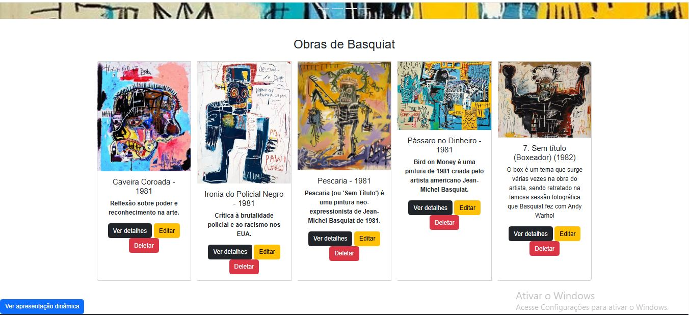
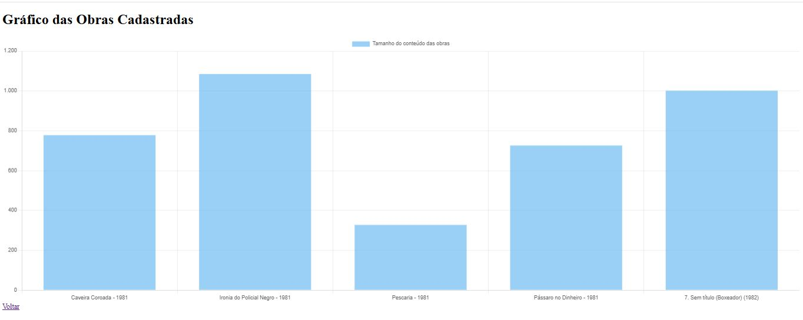

# Trabalho Prático 07 - Semanas 13 e 14

A partir dos dados cadastrados na etapa anterior, vamos trabalhar formas de apresentação que representem de forma clara e interativa as informações do seu projeto. Você poderá usar gráficos (barra, linha, pizza), mapas, calendários ou outras formas de visualização. Seu desafio é entregar uma página Web que organize, processe e exiba os dados de forma compreensível e esteticamente agradável.

Com base nos tipos de projetos escohidos, você deve propor **visualizações que estimulem a interpretação, agrupamento e exibição criativa dos dados**, trabalhando tanto a lógica quanto o design da aplicação.

Sugerimos o uso das seguintes ferramentas acessíveis: [FullCalendar](https://fullcalendar.io/), [Chart.js](https://www.chartjs.org/), [Mapbox](https://docs.mapbox.com/api/), para citar algumas.

## Informações do trabalho

- Nome: Raiany Morais Ribeiro 
- Matricula:904589
- Proposta de projeto escolhida: Artista/Jean Michael Basquiat 
- Breve descrição sobre seu projeto:Meu projeto e sobre um jovem artista negro chamado Jean Michael Basquiat, que morreu por overdose de mistura de drogas aos 27 anos, sua obra mais cara foi vendida por R$110,5 milhões, suas obras criticavam o racismo e a desigualdade social.

Nessa etapa foi implementada um gráfico utilizando a biblioteca Chart.js. 
O gráfico é sobre o tamanho do conteúdo das obras.
Criei uma nova página (grafico.html) que consome os dados do json-server.
Realizei testes inserindo, editando e removendo registros no db.json.

